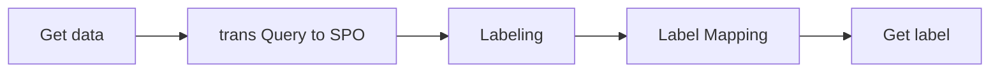

# Traing phase Enhancing SPARQL Query Performance With Recurrent Neural Networks


In this repository, we will focus on discussing the Training Phase. For detailed information, please refer to the related [papers](https://github.com/hsjinde/Enhancing-SPARQL-Query-Performance-With-Recurrent-Neural-Networks).

</img>

## Environment

- python version : `3.7.16`
- requirements : pip3 install -r requirements.txt

## Multi-label Tagging

source code : [AutotagTarget.py](https://github.com/hsjinde/Traing-phase-Enhancing-SPARQL-Query-Performance-With-Recurrent-Neural-Networks/blob/main/AutotagTarget.py)

Extracts and tags query statements from LCQUAD datasets. The code implements the conversion of query statements into a specific labeling format and returns the processed dataset.




## Traing phase

This study presents a modeling approach based on the BR (Binary Relevance) and CC (Correlation between Classes) methods. The model consists of three layers: Input Layer, Modeling Layer, and Output Layer. The Input Layer maps the input question to a vector space using pre-trained Word Embedding and POS Embedding techniques. The Modeling Layer utilizes Bi-directional LSTMs for feature extraction, combining outputs from both directions to capture more information from the sentence. The Output Layer uses sigmoid as the activation function to calculate the probability of the question being relevant to the label.

The training approach involves treating each label-question pair as an independent binary classification task in the BR method. In the CC method, the models incorporate answers from previous labels into the training set, allowing for the correlation between labels. This process is repeated for each label, gradually building upon previous answers to improve model training.

</img>

###  Required documents

#### Word Embedding
- [GloVe](https://nlp.stanford.edu/projects/glove/): Global Vectors for Word Representation
- [BERT](https://huggingface.co/docs/transformers/model_doc/auto) : Bidirectional Encoder Representations from Transformers
#### POS Embedding


### BR

#### Using Glove
**source code :**

```python
def create_model(wordsList, wordVectors, posList, posVectors, W, U, layers=1, bidirectional=False, use_pos=False):
    K.clear_session()
    
    word_input = Input(shape=(maxlen,))
    word_embed = Embedding(len(wordsList), W, weights=[np.array(wordVectors)], trainable=False)(word_input)
    
    inputs = [word_input]
    
    if use_pos:
        pos_input = Input(shape=(maxlen,))
        pos_embed = Embedding(len(posList), 20, weights=[np.array(posVectors)], trainable=False)(pos_input)
        data_concatenate = Concatenate()([word_embed, pos_embed])
        inputs.append(pos_input)
    else:
        data_concatenate = word_embed
    
    if bidirectional:
        lstm_layer = Bidirectional(LSTM(U, return_sequences=(layers > 1)))(data_concatenate)
    else:
        lstm_layer = LSTM(U, return_sequences=(layers > 1))(data_concatenate)
    
    for _ in range(layers - 1):
        dense_1 = Dense(U * 2)(lstm_layer)
        add = Add()([dense_1, lstm_layer])
        norm = LayerNormalization()(add)
        if bidirectional:
            lstm_layer = Bidirectional(LSTM(U, return_sequences=False))(norm)
        else:
            lstm_layer = LSTM(U, return_sequences=False)(norm)
```

#### Using BERT

```python 
class CreateModel:  
    def create_layer(U, maxlen, num_layers):
        K.clear_session()
        bert = TFAutoModel.from_pretrained('bert-base-cased')
        input_ids = Input(shape=(maxlen,), dtype='int32')
        mask = Input(shape=(maxlen,), dtype='int32')
        embeddings = bert(input_ids, attention_mask=mask)[0]
        embeddings = BatchNormalization()(embeddings)
        
        x = Dense(U * 2)(embeddings)
        for _ in range(num_layers):
            lstm_layer = Bidirectional(LSTM(U, return_sequences=False))(x)
            x = Add()([x, lstm_layer])
            x = LayerNormalization()(x)
            x = Dense(U * 2)(x)
        
        output = Dense(1, activation='sigmoid')(x)
        model = tf.keras.Model(inputs=[input_ids, mask], outputs=output)
        model.layers[2].trainable = False
        model.compile(optimizer=tf.keras.optimizers.Adam(0.001), loss='binary_crossentropy', metrics=['accuracy'])
        return model
```

### CC

