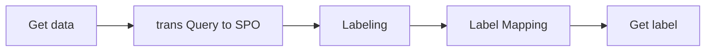

# Traing phase Enhancing SPARQL Query Performance With Recurrent Neural Networks

In this repository, we will focus on discussing the Training Phase. For detailed information, please refer to the related [papers](https://github.com/hsjinde/Enhancing-SPARQL-Query-Performance-With-Recurrent-Neural-Networks).

</img>

Query phase : [End to End](https://github.com/hsjinde/Query-phase-Enhancing-SPARQL-Query-Performance-With-Recurrent-Neural-Networks)

## Environment

- python version : `3.7.16`
- requirements : pip3 install -r requirements.txt

## Training Data
- [QALD](https://github.com/ag-sc/QALD/tree/master)
- [LC-QuAD](https://github.com/AskNowQA/LC-QuAD)
- Provide our format : [LC-QuAD data](https://github.com/hsjinde/Traing-phase-Enhancing-SPARQL-Query-Performance-With-Recurrent-Neural-Networks/tree/main/Data) 

## Multi-label Tagging

source code : [AutotagTarget.py](https://github.com/hsjinde/Traing-phase-Enhancing-SPARQL-Query-Performance-With-Recurrent-Neural-Networks/blob/main/AutotagTarget.py)

The code implements the conversion of query statements into a specific labeling format and returns the processed dataset.

## Traing phase

This study introduces a model based on Binary Relevance (BR) and Classifier Chains (CC) methods. It has three layers: Input (using Word and POS Embeddings), Modeling (Bi-directional LSTM for feature extraction), and Output (sigmoid activation for label relevance). BR treats each label-question pair as an independent binary classification, while CC incorporates previous label predictions to capture label correlations, improving training.

</img>

###  Required documents

source code : [preprocessing.py](https://github.com/hsjinde/Traing-phase-Enhancing-SPARQL-Query-Performance-With-Recurrent-Neural-Networks/blob/main/preprocessing.py)
 
#### Word Embedding
- [GloVe](https://nlp.stanford.edu/projects/glove/): Global Vectors for Word Representation

- [BERT](https://huggingface.co/docs/transformers/model_doc/auto) : Bidirectional Encoder Representations from Transformers

#### POS Embedding

POS tags help in NLP by providing information about word neighbors and syntactic structure. The research team used Skip-gram to train POS embeddings with Treebank as the dataset and a window size of 5, using the first and last n words for predictions.

provides this program POS embedding : `./POS embedding/pos_emb_win5_size20.txt`

### BR

source code : [Binary Relevance.py](https://github.com/hsjinde/Traing-phase-Enhancing-SPARQL-Query-Performance-With-Recurrent-Neural-Networks/blob/main/Binary%20Relevance.py)

### CC

source code : [Classifier Chains.py](https://github.com/hsjinde/Traing-phase-Enhancing-SPARQL-Query-Performance-With-Recurrent-Neural-Networks/blob/main/Classifier%20Chains.py)

### Ensemble BR

The ensemble BR framework trains the correlation between labels, allowing for the prediction of SPARQL queries involving multiple RDF triples while considering the correlation between labels.

</img>
